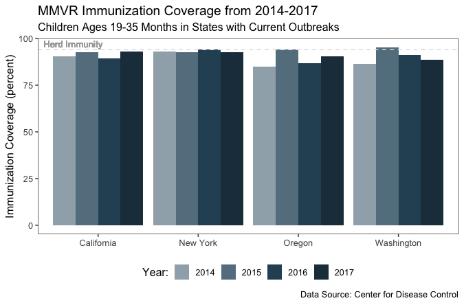
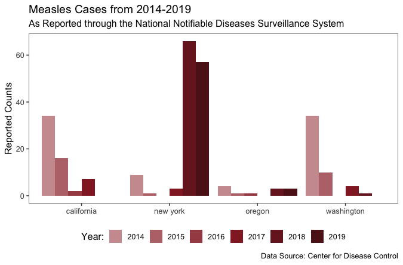
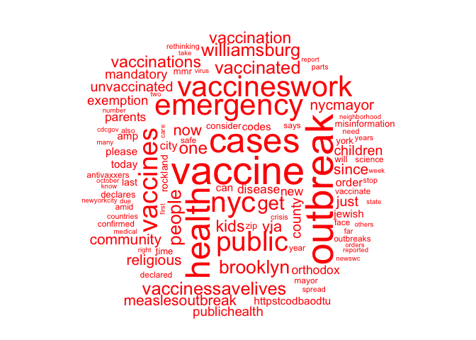
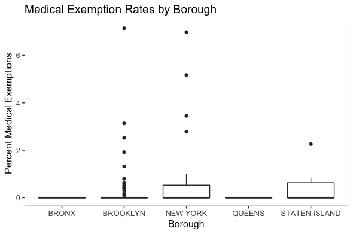
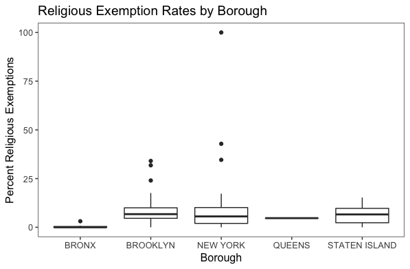

---
output:
  html_document:
    df_print: paged
---

<center><h1>A Curious Case of Measles</h1></center>

<center><h1><font size ="5">The Physical and Digital Spread of Measles</font></h1></center>

```{r setup, include=FALSE}
knitr::opts_chunk$set(echo = TRUE)
```

```{r, echo=FALSE, warning=FALSE, message=FALSE, comment=FALSE}
library(dplyr)
library(ggplot2)
library(ggthemes)
library(maps)
library(openxlsx)
library(plotly)
library(tools)
library(openxlsx)
library(reshape2)
```

<br>

The World Health Organization (WHO) declared measles eliminated in the United States in 2000. Recently, however, various outbreaks  now threaten that status. Our project uses data from the Center for Disease Control (CDC), Google, Twitter, and affected states to explore whether trends in the digital frenzy around measles correspond with actual cases. 

## {.tabset}

### History

Regular documentation of measles cases in the United States can be traced back to 1912, when it became complusory for health facilities to report cases. Incidences of measles, and related diseases such as Rubella and Mumps, dropped dramatically after the invention of the Measles, Mumps and Rubella (MMR) vaccine. A great accomplishment of modern medicine, the vaccine is 97% effective in preventing measles contraction in children who receive both doses prior to the age of six.

The following visualizations, created with data from the CDC's National Notifiable Diseases Surveillance System, reveals that the height of measles cases in the United States occurred during the immigration influx generated by World War II. Case counts quickly taper off following the development of the measles vaccine and, later, the MMR vaccine.
<br><br>

<center>
```{r, echo=FALSE, warning=FALSE, message=FALSE, comment=FALSE}
#df <- read.csv(file.choose()) #select "measles_cases_USA_by_state_1928_to_2002.csv"
df <- read.csv("./data/raw/measles_cases_USA_by_state_1928_to_2002.csv")
total_counts_usa <- df %>% group_by(year, disease) %>% summarize(total_counts = sum(cases))
p.total.counts.usa <- ggplot(total_counts_usa, aes(x=year, y = total_counts, group=disease, color= disease)) + 
  geom_line()+xlab("Year") + xlim(c(1920, 2005)) + ylim(c(0, 850000)) + 
  ggtitle(c("MMR Incidences - United States: 1928 - 2002")) + 
  theme_few() +labs(color = "Disease") + scale_y_discrete("Case Counts", c(50000, 100000, 150000, 200000, 250000)) + 
  scale_color_fivethirtyeight() + geom_vline(xintercept = 1938, linetype = "dotted") + 
  geom_vline(xintercept = 1963, linetype = "dotted") + geom_vline(xintercept=1971, linetype = "dotted") + 
  geom_text(aes(x=1938, y =600000, label="\nWW2 Immigrant Influx"), colour="black", 
            text=element_text(family= "Times", size=8), angle=90) + 
  geom_text(aes(x=1963, y =500000, label="\nMeasles Vaccine Developed"), colour="black", 
            text=element_text(family= "Times", size=8), angle = 90) + 
  geom_text(aes(x=1971, y =400000, label="\nMMR Vaccine Developed"), colour="black", 
            text=element_text(family= "Times", size=8), angle = 90) + 
  geom_vline(xintercept = 2000, linetype = "dotted") + 
  geom_text(aes(x=2000, y =400000, label="\nMeasles Declared Eradicated"), angle = 90, colour="black", 
            text=element_text(family= "Times", size=8))
p.total.counts.usa
```
</center>

Measles, Mumps, and Rubella cases in New York state historically mirrored national trends.

<center>
```{r, echo=FALSE, warning=FALSE, message=FALSE, comment=FALSE}
total_counts_ny <- df %>% 
  filter(state_name=="NEW YORK") %>% group_by(disease, year) %>% summarize(total_counts = sum(cases))

p.total.ny <- ggplot(total_counts_ny, aes(x=year, y = total_counts, group=disease, color= disease)) + 
  geom_line()+xlab("Year") + xlim(c(1920, 2005)) + ylim(c(0, 125000)) +
  ggtitle(c("MMR Incidences - New York: 1928 - 2002")) + theme_few() +
  labs(color = "Disease") + 
  scale_y_discrete("Case Counts", c(50000, 100000)) + scale_color_fivethirtyeight() + 
  geom_vline(xintercept = 2000, linetype = "dotted") + 
  geom_text(aes(x=2000, y =50000, label="\nMeasles Declared Eradicated"), angle = 90, colour="black", text=element_text(family= "Times", size=8)) 
p.total.ny
```
</center>
<br>

### Today

#### Immunization Rates and Current Cases

In spite of the efficacy of the MMR vaccine, parents in the United States are increasingly electing not to vaccinate their children. This, in turn, lowers "herd immunity," the immunization coverage threshold at which a population is indirectly protected from disease, putting unvaccinated children and immunocompromised individuals at risk. Herd immunity against measles is attained when 93-95% of a population is vaccinated (for the purposes of this project, it was set to 94%). 

In December 2018, cases of measles began to rise as international travelers exposed to the disease abroad came in contact with disease-vulnerable populations. As of mid-April, cases occurred in 22 states and outbreaks (higher than normal case counts) were reported in six states, California, Michigan, New Jersey, New York, Oregon, and Michigan. Cases affiliated with these outbreaks are depicted at the county level in the map below. 
<br><br>
<center>
```{r, echo=FALSE, warning=FALSE, message=FALSE, comment=FALSE}
#county <- map_data("county")
#county_measles <- read.xlsx(./data/raw"county_level_measles.xlsx") #review this line
#county_measles <- read.csv(file.choose()) #use line above or select "county_level_measles.csv"
#colnames(county_measles)[colnames(county_measles)=="state"] <- "region"
#colnames(county_measles)[colnames(county_measles)=="county"] <- "subregion"
county <- map_data("county")
county_measles <- read.xlsx("./data/raw/county_level_measles.xlsx")
colnames(county_measles)[colnames(county_measles)=="state"] <- "region"
colnames(county_measles)[colnames(county_measles)=="county"] <- "subregion"
county_measles$region <- tolower(county_measles$region)
county_measles$subregion <- tolower(county_measles$subregion)


map.df <- merge(county, county_measles, by=c("region", "subregion"), all.x=T)

map.df <- map.df[order(map.df$order),]

t <- list(
  family = "times new roman",
  size = 14,
  color = 'black')

map.df$subregion <- toTitleCase(map.df$subregion)
map.df$County = paste(map.df$subregion, 
                    "<br>Number of Measles Cases: " , map.df$cases,
                     "<br>Unemployment: ", map.df$unemployment.rate,
                     "<br>Poverty Rate: ", map.df$percent.poverty)

plot1 <- ggplot(map.df, aes(x=long,y=lat,group=group, fill = map.df$cases, label = County))+
  geom_path() +
  geom_polygon(aes(fill = cases), color="grey", size=.01)+
   #   scale_color_gradient(low = "gray", high = "blue") +
  #scale_fill_gradientn(colours=rev(heat.colors(10)),na.value="grey90") + 
  scale_fill_gradient(low="#C4888C", high = "#93252D", na.value="#D6DFDF")+
    labs(title = "2019 Outbreak States: Measles Cases by County ", fill = NULL) + 
  theme_few() + 
  coord_fixed() +
  coord_map() +
  labs(fill="Case Counts:\n") +
  theme(axis.ticks = element_blank()) +
  xlab(NULL) + ylab(NULL) + 
  theme(legend.position = "bottom", 
        panel.background = element_rect(fill = NA, colour = "#cccccc"),
        axis.text.x = element_blank(), axis.text.y = element_blank())

plot1 <- ggplotly(plot1, tooltip = c("label")) %>% 
  layout(font = t,
         annotations = 
           list(x = 0.25, y = -.25, #position of text adjust as needed 
                text = "Source: State's Department of Health and U.S. Department of Agriculture", 
                showarrow = F, xref='paper', yref='paper', 
                xanchor='right', yanchor='auto', xshift=0, yshift=0)
  )

#map.df <- merge(county,county_measles, by=c("region", "subregion"), all.x=T)

#map.df <- map.df[order(map.df$order),]

#map.df$my_text=paste("Number of measles cases: " , map.df$cases, sep="")

#map.df
#plot1 <- ggplot(map.df, aes(x=long,y=lat,group=group, text = my_text))+ geom_path()+ 
 # geom_polygon(aes(fill = cases), color="grey", size=.01)+ theme_void() +
  #scale_fill_gradientn(colours=rev(heat.colors(10)),na.value="#D6DFDF")+
  #coord_map()

#The following code incorporates our colors, but I can't get the map size correct.
# plot1 <- ggplot(map.df, aes(x=long,y=lat,group=group, text = my_text))+ geom_path() +
#   geom_polygon(aes(fill = cases), color="grey", size=.01)+ labs(fill="Case Counts:\n") +
#   theme_void() + theme(legend.position = "bottom") +
#   scale_fill_gradient(low="#C4888C", high = "#93252D", na.value="#D6DFDF")+
#   coord_map() 

#plot1 <- ggplotly(plot1)


plot1
```
</center>


The most active outbreaks as of mid-April were recorded in California, New York, Oregon, and Washington. Immunization coverage levels and case counts (as reported to the National Notifiable Diseases Surveillance System) are compared below to see how these figures have varied in recent years across the four states.

<center>

</center>

The most recent immunization coverage data from the CDC is current to 2017 and reveals that in each of these four states, herd immunity against measles has rarely been achieved in recent years.


Measles cases in California, New York, Oregon, and Washington spanning the same time period to mid-April 2019 are given below.

<center>

</center>

The 2019 measles cases in New York are particularly striking. The number of cases reported in New York in 2019 is nearly on par with that from 2018, despite the fact that the data for 2019 only includes the first three and a half months of the year.
<br>

#### What are people in New York saying?

As measles cases have spread in the United States, so has the online dicussion surrounding the condition. We analyzed measles-related Google search terms and tweets, first to identify trends over time and top concerns, then to compare how pro- versus anti-vaccination opinions differ. 
<br>
Spikes in Google searches for measles by New York residents parallel outbreaks. The two large spikes in searches for measles symptoms coincide with the 2015 California outbreak and the current outbreaks. The spikes suggest New York residents are concerned. They want to either be educated on measles symptoms since there is a risk in their community or they are concerned they or someone they know is exhibiting these symptoms. Either way, the spike indicates that New Yorkers believe they are at risk.  
<br>

<center>
```{r, echo=FALSE, warning=FALSE, message=FALSE, comment=FALSE}
search_ny <- read.csv('./data/raw/google search index/google measles search index - NY State.csv')
search_ny$Date <- as.Date(search_ny$Date, format= '%m/%d/%y')
names(search_ny) <- c("date", "Measles Symptoms", "Measles Rash", "Symptoms of Measles", "Measles Pictures")
meltdf <- melt(search_ny,id="date")
#ggplot(meltdf,aes(x = date ,y=value,colour=variable,group=variable)) + geom_line() + xlab("Year") +ylab("Incidence") + ggtitle(c("Google Search Index for Measles - New York")) + theme_few() + theme() + labs(color = "Search Term")
plot_ly(meltdf, x = ~date, y = ~value, color = ~variable, group= ~variable, type = "scatter", mode = 'lines') %>% 
  layout(title= "Google Search Index for Measles - New York", scene = list(xaxis = list(title = "Date"), yaxis = list(title = "Index")))
```
</center>
<br>

On Twitter, the most common term associated with the #measles hashtag in New York in the immediate weeks after the public health emergency declaration, aside from the disease itself, was vaccination. This top term hints at the controversy that, in part, is fueling the current outbreak's spread. The most popular terms indicate a call to action to vaccinate with the overall message that vaccines work. 
<br>

```{r, echo=FALSE, warning=FALSE, message=FALSE, comment=FALSE}
library(tm)
library(wordcloud)
library(dplyr)
library(tidytext)
library(ggplot2)
library(ggthemes)
library(plotrix)
library(tidyr)

antivax.all <- readRDS("data/raw/twitter data/antivax.all.rds")
provax.all <- readRDS("data/raw/twitter data/provax.all.rds")
measles.ny.all <- readRDS("data/raw/twitter data/measles.ny.all.rds")

colnames(antivax.all)[colnames(antivax.all)=="status_id"] <- "doc_id"
colnames(provax.all)[colnames(provax.all)=="status_id"] <- "doc_id"
colnames(measles.ny.all)[colnames(measles.ny.all)=="status_id"] <- "doc_id"


df_source1 <- DataframeSource(measles.ny.all)
df_corpus1 <- VCorpus(df_source1)
measles_stops <- c("measles", stopwords("en"))
removeNumPunct <- function(x){gsub("[^[:alpha:][:space:]]*", "", x)}
clean_corpus <- function(corpus){
  corpus <- tm_map(corpus, removePunctuation)
  corpus <- tm_map(corpus, content_transformer(tolower))
  corpus <- tm_map(corpus, removeWords, measles_stops)
  corpus <- tm_map(corpus, removeNumbers)
  corpus <- tm_map(corpus, content_transformer(removeNumPunct))
  corpus <- tm_map(corpus, stripWhitespace)
  return(corpus)
}
corpus_clean1 <- clean_corpus(df_corpus1)

antivax.text <- antivax.all$text
provax.text <- provax.all$text

antivax.text <- paste(unlist(antivax.text), collapse =" ")
provax.text <- paste(unlist(provax.text), collapse =" ")

antivax.text.df <- as.data.frame(antivax.text)
provax.text.df <- as.data.frame(provax.text)
antivax.text.df$doc_id <- "Anti-vax"
provax.text.df$doc_id <- "Pro-vax"
names(antivax.text.df)[names(antivax.text.df) == "antivax.text"] <- "text"
names(provax.text.df)[names(provax.text.df) == "provax.text"] <- "text"
all.df <- rbind(antivax.text.df, provax.text.df)
all.df <- all.df[, c(2,1)]
all.df <- DataframeSource(all.df)
df_corpus2 <- VCorpus(all.df)

corpus_clean2 <- clean_corpus(df_corpus2)

corpus_tdm1 <- TermDocumentMatrix(corpus_clean1)
matrix1 <- as.matrix(corpus_tdm1)

sort <- sort(rowSums(matrix1), decreasing=TRUE)
sort.df <- data.frame(word = names(sort), freq=sort)

tidy1 <- tidy(corpus_tdm1)
#head(tidy1)

hashtag_col <- c("vaccinated"="#8B9FAA", "vaccinessavelives"="#8B9FAA", "williamsburg"="#8B9FAA",
                 "brooklyn"="#788F9C", "people"="#788F9C", "get"="#657F8E", "vaccines"="#526F80",
                 "public"="#3F5F72", "nyc"="#2C4F64", "vaccineswork"="#2C4F64", "emergency"="#28485B",
                 "health"="#254152", "cases"="#213A49", "outbreak"="#1D3340", "vaccine"="#182C37")

tidy1 <- tidy1 %>% group_by(term) %>%
                summarise(n = sum(count)) %>%
                top_n(n = 15, wt = n)  %>%
                ungroup() %>%
                mutate(term = reorder(term, n)) %>%
ggplot(aes(term, n)) + geom_bar(stat = "identity", fill=hashtag_col) + 
  coord_flip()  + theme_few() + labs(title="Most Frequent Terms in NY #measles Tweets",  x="", y = "Count") 

# measles.cloud <- wordcloud(words = sort.df$word, freq=sort.df$freq, min.freq=2,
#           max.words = 100, random.order = FALSE,
#           colors="red", scale=c(3.5,0.25))
```

<center>
```{r, echo=FALSE, warning=FALSE, message=FALSE, comment=FALSE}
tidy1
```
</center>

<br>
Words commonly associated with the #measles are also visualized through a wordcloud below.

<center>

</center>
<br>

The most frequent terms in tweets from anti-vaxxers are highlighted in red, while top terms from a pro-vaccine point of view are featured in blue. The hashtags used to identify anti-vaxxers were #VaccineInjury, #VaccineFailure, #VaccineHarm, and #VaccinesCauseAutism. The hashtags used to identify pro-vaxxers were  #VaccinesWork and #GetVax. Both sides utilize an emotional plea, one being that vaccines pose a risk of injury and autism to those receiving it, as well as overall failure. The pro-vaccines side pleads that vaccines work and protect, citing organizations such as UNICEF and the Gates Foundation. 

<center>
```{r,echo=FALSE, warning=FALSE, message=FALSE, comment=FALSE}
corpus_tdm2 <- TermDocumentMatrix(corpus_clean2)
matrix2 <- as.matrix(corpus_tdm2)
comparison <- comparison.cloud(matrix2, colors = brewer.pal(8, "Set1"), title.size= 1, 
                 max.words = 150)
# common <- commonality.cloud(matrix2, colors = brewer.pal(8, "Set1"), 
#                   scale=c(3.5,0.25), title.size= 1, 
#                  max.words = 150)
```

```{r, echo=FALSE, warning=FALSE, message=FALSE, comment=FALSE}
#comparison
```
</center>
<br>

### School Focus

```{r, echo=FALSE, warning=FALSE, message=FALSE, comment=FALSE}
library(stringr)
library(dplyr)
library(choroplethr)
library(choroplethrMaps)
library(leaflet)
library(ggmap)
library(ggplot2)
library(readr)
library(RColorBrewer)
library(tm)
library(wordcloud)
library(ggthemes)
library(reshape2)
```

This section delves into immunization surveys collected at the school level in New York State, beginning with the 2012-2013 school year. We are interested in understanding the changes that occurred prior to the measles outbreak in 2019.

First, we examine the trends in exemption rates over time and look at immunization rates at the county level.

```{r, echo=FALSE, warning=FALSE, message=FALSE, comment=FALSE}
#df2 <- read.csv(file.choose()) #select
#"School_Immunization_Survey__Beginning_2012-13_School_Year.csv"
df2 <- read.csv("./data/raw/School_Immunization_Survey__Beginning_2012-13_School_Year.csv")
```

```{r, echo=FALSE, warning=FALSE, message=FALSE, comment=FALSE}
df2$year <- substr(df2$Report.Period, 6, 9)
df2$County <- tolower(df2$County)
df2 <- df2 %>% 
  dplyr::select(School.ID, Type, School.Name, Percent.Medical.Exemptions, Percent.Religious.Exemptions, 
         Percent.Immunized.Measles, Street, City, County, Zip.Code, Location, year)
```

```{r, echo=FALSE, warning=FALSE, message=FALSE, comment=FALSE}
df2$lat <- as.character(df2$Location) %>% 
  strsplit("\n") %>% 
  lapply(., "[", 3) %>% 
  unlist() %>% 
  gsub("[()]", "", .) %>% 
  strsplit(., ",") %>% 
  lapply(., "[", 1) %>% 
  unlist() %>% 
  as.character() %>% 
  as.numeric()
df2$lon <- as.character(df2$Location) %>% 
  strsplit("\n") %>% 
  lapply(., "[", 3) %>% unlist() %>% 
  gsub("[()]", "", .) %>% 
  strsplit(., ",") %>% 
  lapply(., "[", 2) %>%
  unlist() %>% 
  as.numeric() 
```

#### Identifying Trends Over Time

```{r, echo=FALSE, warning=FALSE, message=FALSE, comment=FALSE}
exemp_rates <- df2 %>% 
  group_by(year) %>% 
  summarize (avg_med_rate = mean(Percent.Medical.Exemptions))
exemp_rates_rel <- df2 %>% 
  group_by(year) %>% 
  summarize(avg_rel_rate = mean(Percent.Religious.Exemptions))
exemp_rates <- left_join(exemp_rates, exemp_rates_rel)
colnames(exemp_rates) <- c("Year", "Average Medical Exemption Rate", "Average Religious Exemption Rate")
```

```{r, echo=FALSE, warning=FALSE, message=FALSE, comment=FALSE}
meltdf <- melt(exemp_rates, id= "Year")
```

<center>
```{r, echo=FALSE, warning=FALSE, message=FALSE, comment=FALSE}
ggplot(meltdf, aes(x = Year, y = value, group = variable, color = variable)) + 
  geom_line() + labs("Legend") + 
  ggtitle("Average Exemption Rates 2013-2018") + theme_few() + ylab("Rate") + 
  theme(legend.position="bottom", legend.title = element_blank())
```
</center>

Over time we see that while the average medical exemption rate has remained consistent at about 0.25%, the average religious exemption rate is increasing. In 2018, this rate was 3.77%.
<br>

#### Average Immunization Rates by Counties

Below, average measles immunization rates are mapped by county.

```{r, echo=FALSE, warning=FALSE, message=FALSE, comment=FALSE}
risky <- df2 %>% 
  filter(year == 2018) %>% 
  filter(Percent.Immunized.Measles < 94) %>% 
  arrange(Percent.Immunized.Measles)
```


```{r, echo=FALSE, warning=FALSE, message=FALSE, comment=FALSE}
county_rates <- df2 %>% 
  filter(year == 2018) %>% 
  group_by(County) %>% 
  summarize(avg_immun = mean(Percent.Immunized.Measles))
colnames(county_rates) <- c("region", "value")
data(county.regions)
counties <- county.regions %>% filter(state.name == "new york") %>% dplyr::select(county.name, county.fips.character)
colnames(counties) <- c("region", "fips")
county_rates <- left_join(county_rates, counties) %>% dplyr::select(fips, value)
colnames(county_rates) <- c("region","value")
```

<center>
```{r, echo=FALSE, warning=FALSE, message=FALSE, comment=FALSE}
county_rates$region <- as.numeric(county_rates$region)
choroplethr::county_choropleth(county_rates, title = "Average Immunization Rates by County",num_colors = 7, state_zoom = "new york", legend = "Immunization Rates")
```
</center>

We then identify the counties that have immunization rates less than 94%, again as this is the benchmark for successfully establishing herd immunity. There are 15 counties that meet this criteria. The bar chart below depicts these 15 counties at risk of measles contagion.

```{r, echo=FALSE, warning=FALSE, message=FALSE, comment=FALSE}
county_rates <- df2 %>% 
  filter(year == 2018) %>% group_by(County) %>% 
  summarize(avg_immun = mean(Percent.Immunized.Measles)) %>% 
  filter(avg_immun < 94)
```

<center>
```{r, echo=FALSE, warning=FALSE, message=FALSE, comment=FALSE}
nyc_col <- c("montgomery"="#EBEFF0", "yates"="#D8DFE2", "allegany"="#C5CFD4", "cattaraugus"="#B2BFC6", 
             "seneca"="#9FAFB8", "st. lawrence"="#8B9FAA", "lewis"="#788F9C", "chautauqua"="#657F8E", 
             "schuyler"="#526F80", "cortland"="#3F5F72", "oneida"="#2C4F64", "fulton"="#28485B", "rockland"="#254152", 
             "ontario"="#213A49", "cayuga"="#1D3340")

ggplot(county_rates, aes(x=reorder(County, -avg_immun), y = avg_immun, fill = County)) + 
  geom_bar(stat="identity") + coord_flip() + theme_few() + 
  ggtitle("Average Immunization Rates by County (2018)") + 
  theme(legend.position = "none") + 
  xlab("County") + ylab("Average Immunization Rate") +
  scale_fill_manual(values=nyc_col)
```
</center>

The top 5 counties in New York with the lowest measles vaccination rates are Montgomery, Yates, Allegany, Cattaraugus, and Seneca.

```{r, echo=FALSE, warning=FALSE, message=FALSE, comment=FALSE}
pal = colorFactor("Set1", domain = risky$Type)
color_type = pal(risky$Type)
content <- paste("School Name:",risky$School.Name,"<br/>",
                 "% Immunized:",risky$Percent.Immunized.Measles,"<br/>",
                 "% Religious Exemption",risky$Percent.Religious.Exemptions,"<br/>",
                 "% Medical Exemption",risky$Percent.Medical.Exemptions,"<br/>")
```

The interactive map below shows the schools in New York that have immunization rates below the ideal threshold needed to achieve herd immunity. We have identified 574 schools as being risky.

<center>
```{r, echo=FALSE, warning=FALSE, message=FALSE, comment=FALSE}
m <- leaflet(risky) %>% 
  addTiles() %>%
  addCircles(lat= ~lat, lng= ~lon, color = color_type, popup = content) %>% addLegend(pal = pal, values = ~risky$Type, title = "School Type")
m  
```
</center>
<br>

#### Type of Risky Schools
<center>
```{r, echo=FALSE, warning=FALSE, message=FALSE, comment=FALSE}
risk_col <- c("BOCES School" = "#8C928B", "School District" = "#475D5D", 
              "Public School" = "#254253", "Private School" = "#121F33")
risk_col <- c("BOCES School" = "#9AA098", "School District" = "#587273", 
              "Public School" = "#2C4F64", "Private School" = "#132238")
ggplot(risky, aes(x=forcats::fct_rev(forcats::fct_infreq(Type)), fill = Type)) + 
  geom_bar(stat="count") + 
  labs(title="Type of Risky Schools", x=NULL, y="Number of Schools", fill="School Type:") + 
  theme_few() + scale_fill_manual(values = risk_col) +
  theme(legend.position="none") +
  guides(fill=guide_legend())
```
</center>

Among those schools identified as at risk of becoming a location where measles can spread, the most common type of school is private schools. Private schools are subject to fewer government regulations and statutes than public schools, particularly when it comes to mandatory immunization. 
<br>

#### Text Analysis of Risky Schools

```{r, echo=FALSE, warning=FALSE, message=FALSE, comment=FALSE}
schools <- unique(risky$School.Name)
txt <- schools
frequentSchool = c("school","preschool","academy","elementary","sch", "institute", "center","elem")
myCorpus<-VCorpus(VectorSource(txt))
myCorpusClean <- myCorpus %>% 
  tm_map(content_transformer(tolower)) %>% 
  tm_map(content_transformer(removeNumbers)) %>% 
  tm_map(content_transformer(removePunctuation)) %>%
  tm_map(content_transformer(removeWords),frequentSchool) %>%
  tm_map(content_transformer(removeWords),tidytext::stop_words$word)
tdm_1<- TermDocumentMatrix(myCorpusClean, control = list(minWordLength = 3))
m_tdm_1 <-as.matrix(tdm_1)
word.freq.1<-sort(rowSums(m_tdm_1), decreasing=T)
```

```{r, echo=FALSE, warning=FALSE, message=FALSE, comment=FALSE}
#head(word.freq.1, 5L)
```

"Christian" is the most frequent term among the risky schools' names.
<center>
```{r, echo=FALSE, warning=FALSE, message=FALSE, comment=FALSE}
set.seed(12345)
wordcloud(words=names(word.freq.1),freq = word.freq.1,random.order=F,colors=brewer.pal(9,"RdBu"),max.words=100)
title(paste0('Most frequent 1-grams in school names'),col.main='black',cex.main=2)
```
</center>

Following "christian", words associated with schools that have low immunization rates include "yeshiva" and "montessori," referring to relgious and alternative learning institutions.
<br>

#### Text Analysis of Riskiest Schools 

```{r, echo=FALSE, warning=FALSE, message=FALSE, comment=FALSE}
riskiest <- risky %>% filter(Percent.Immunized.Measles == 0) %>% filter(!is.na(Percent.Religious.Exemptions == 0))
#dim(riskiest)
```

Of the 574 risky schools with below-threshold immunization rates, there are 91 where no child is vaccinated against measles.

 <center> **Most frequent 2-grams in school names** </center>

<center>
```{r, echo=FALSE, warning=FALSE, message=FALSE, comment=FALSE}
schools <- unique(riskiest$School.Name)
txt <- schools
myCorpus<-VCorpus(VectorSource(txt))

myCorpusClean <- myCorpus %>% 
  tm_map(content_transformer(tolower)) %>% 
  tm_map(content_transformer(removeNumbers)) %>% 
  tm_map(content_transformer(removePunctuation)) %>%
  tm_map(content_transformer(removeWords),frequentSchool) %>%
  tm_map(content_transformer(removeWords),tidytext::stop_words$word)

tdm_1<- TermDocumentMatrix(myCorpusClean, control = list(mm_tdm_1 <-as.matrix(tdm_1),
inWordLength = 3))
word.freq.1<-sort(rowSums(m_tdm_1), decreasing=T)

BigramTokenizer <- function(x) unlist(lapply(ngrams(words(x), 2), paste, collapse = " "), use.names = FALSE)
tdm_2<- TermDocumentMatrix(myCorpusClean, control = list(tokenize = BigramTokenizer))
m_tdm_2 <-as.matrix(tdm_2)
word.freq.2<-sort(rowSums(m_tdm_2), decreasing=T)


set.seed(314)
wordcloud(words=names(word.freq.2),freq = word.freq.2,random.order=F,colors=c("navy", "red"),max.words=100)
```
</center>

Again, we see references to religious instituions through words like "muhammed", "menonite", and "amish" in the 91 school names.
<br>

#### Focusing on New York City

```{r, echo=FALSE, warning=FALSE, message=FALSE, comment=FALSE}
df_nyc <- df2 %>% 
  filter(year ==2018) %>% 
  filter(City %in% c("BROOKLYN", "BRONX", "QUEENS", "STATEN ISLAND", "MANHATTAN", "NEW YORK")) %>% 
  filter(Percent.Immunized.Measles < 94) %>% filter(Percent.Medical.Exemptions < 8) %>%   arrange(Percent.Immunized.Measles)
```

```{r, echo=FALSE, warning=FALSE, message=FALSE, comment=FALSE}
pal = colorFactor("Set1", domain = df_nyc$Type)
color_type = pal(df_nyc$Type)
content <- paste("School Name:",df_nyc$School.Name,"<br/>",
                 "% Immunized:",df_nyc$Percent.Immunized.Measles,"<br/>",
                 "% Religious Exemption",df_nyc$Percent.Religious.Exemptions,"<br/>",
                 "% Medical Exemption",df_nyc$Percent.Medical.Exemptions,"<br/>")
```

<center>
```{r, echo=FALSE, warning=FALSE, message=FALSE, comment=FALSE}
m2 <- leaflet(df_nyc) %>% 
  addTiles() %>% 
  addCircles(lng = ~lon, lat = ~lat, color = color_type, popup = content) %>% addLegend(pal = pal, values = ~df_nyc$Type, title = "School Type")
m2
```
</center>

There are 104 schools in the New York City 'at-risk' category. Every school below the 94% immunization threshold in NYC is a private school. These are first reviewed through a static plot.

<center>
```{r, echo=FALSE, warning=FALSE, message=FALSE, comment=FALSE}
newyork <- get_map("new york city", zoom=11)
ggmap(newyork) + geom_point(data=df_nyc, aes(x=lon, y=lat)) + theme_void()
```
</center>

We then compare the medical exemption and the religious exemption rates between NYC boroughs.

```{r, echo=FALSE, warning=FALSE, message=FALSE, comment=FALSE}
df_nyc$City <- factor(as.character(df_nyc$City))
```

```{r, echo=FALSE, warning=FALSE, message=FALSE, comment=FALSE}
p.med.ex <- ggplot(df_nyc, aes(x = City, y = Percent.Medical.Exemptions)) +
  geom_boxplot() + theme_few() + ylab("Percent Medical Exemptions") + xlab("Borough") + 
  ggtitle("Medical Exemption Rates by Borough")
p.rel.ex <- ggplot(df_nyc, aes(x = City, y = Percent.Religious.Exemptions)) +
  geom_boxplot() + theme_few() + ylab("Percent Religious Exemptions") + xlab("Borough") + 
  ggtitle("Religious Exemption Rates by Borough")
```

<br>
<center>
{width=50%}{width=50%}
<br>

#### Examining 2019 Measles Mandate

Under the NYC Measles Mandate, requiring residents of the identified areas to receive the MMR vaccine except when immunity or medical exception can be proved, four zip codes will be affected: 11205, 11206, 11211 and 11249. These zip codes are geographically close to centers of measles outbreaks. However, in a densely populated city with a well-frequented public transit system, a highly contagious disease like measles can spread across boroughs.

```{r, echo=FALSE, warning=FALSE, message=FALSE, comment=FALSE}
mandate <- df2 %>% 
  filter(year ==2018) %>% 
  filter(Zip.Code %in% c(11205, 11206, 11211, 11249))
#dim(mandate)
```

The health mandate covers only 44 schools, whereas we have identifed 104 schools in New York City that are at risk of a measles outbreak. We then perform a text analysis on the school names to see what patterns emerge.

<center>
```{r, echo=FALSE, warning=FALSE, message=FALSE, comment=FALSE}
schools <- unique(mandate$School.Name)
txt <- schools
myCorpus<-VCorpus(VectorSource(txt))

myCorpusClean <- myCorpus %>% 
  tm_map(content_transformer(tolower)) %>% 
  tm_map(content_transformer(removeNumbers)) %>% 
  tm_map(content_transformer(removePunctuation)) %>%
 tm_map(content_transformer(removeWords),frequentSchool) %>%
  tm_map(content_transformer(removeWords),tidytext::stop_words$word)

tdm_1<- TermDocumentMatrix(myCorpusClean, control = list(minWordLength = 1))
m_tdm_1 <-as.matrix(tdm_1)
word.freq.1<-sort(rowSums(m_tdm_1), decreasing=T)
set.seed(12345)
wordcloud(words=names(word.freq.1),freq = word.freq.1,random.order=F,colors=brewer.pal(9,"Set1"),max.words=100)
title(paste0('Most frequent 1-grams in school names'),col.main='black',cex.main=2)
```
</center>

The resulting most frequent terms are very interesting because we previously saw that "christian"" was the most frequent word in the risky dataset in New York State. In contrast, the schools covered under the mandate are primarily Jewish Orthodox insititutions.

<center>
```{r, echo=FALSE, warning=FALSE, message=FALSE, comment=FALSE}
mandate_col3 <- c("YESHIVA FARM SETTLEMENT SCHOOL"="#AEBBC2", "BEIKVEI HATZOIN"="#ABB8BF", 
                  "BE'ER MIRIAM"="#A7B4BC", "BNEI SHIMON YISROEL OF SOPRON"="#A3B1B9", 
                  "OHEL CHAYA"="#A0AEB5", "YESHIVA MESIVTA ARUGATH HABOSEM"="#9DAAB2", 
                "YESHIVA BNOS SPINKA BOYS SCHOOL"="#99A7AF", "BETH CHANA SCHOOL AND HS FOR GIRLS"="#95A4AC",
                "CONG YESHOUS MOSHE OF WILLIAMSBURG"="#92A0A8", 
                "TALMUD TORAH TZEMACH TZADIK VIZNITZ"="#8F9DA5", "YESHIVA BNOS SPINKA"="#8B9AA2", 
                "BNOS CHAYIL"="#88969F", "YESHIVA YESODE HATORAH"="#84939B", 
                "WILLIAMSBURG NORTHSIDE SCHOOL (LOWER SCHOOL)"="#819098", 
                "YESHIVA KEHILATH YAKOV"="#7D8C95", "TALMUD TORAH OF KASHO"="#798992", 
                "YESHIVA AHAVAS ISRAEL"="#76868E", "YESHIVA OF KASHO"="#72828B", 
                "YESHIVA TZEMACH TZADIK VIZNITZ"="#6F7F88", 
                "BNOS YAKOV SCHOOL FOR GIRLS-(ADMINISTRATIVE SITE)"="#6B7C84", 
                "ACH TOV V'CHESED"="#687881", "UTA"="#65757E", "YESHIVA JESODE HATORAH WILSON"="#61727B", 
                "TALMUD TORAH TOLDOS HILLEL-KRASNA"="#5E6E78", 
                "CONGREGATION AHAVAS SHULEM DNA TIFERES BNOS"="#5A6B74", 
                "BETH RACHEL SCHOOL FOR GIRLS"="#566871", "BNOS SQUARE OF WILLIAMSBURG"="#53646E", 
                "BAIS YAAKOV DKHAL ADAS YERIEM"="#50616B", "BAIS RUCHEL HIGH SCHOOL"="#4C5E67", 
                "GREENE HILL SCHOOL"="#485A64", "KHHD YOEL OF SATMAR BP"="#455761", 
                "YESHIVA JESODE HATORAH"="#41545E", "MOSDOS CHASIDEI SQUARE"="#3E505A", 
                "TALMUD TORAH DNITRA"="#3B4D57", "HYCHEL HATORAH OF WILLIAMSBURG"="#374A54", 
                "CONG DARKEI TSHIVO OF DINOV"="#334651", "JEWISH CTR FOR SPEC EDUC"="#30434D", 
                "KEREN HATORAH"="#2D404A", "OHEL ELOZER"="#293C47", "QUEEN OF THE ROSARY"="#253943", 
                "QUEENS OF ALL SAINTS"="#223640", "THE WILLIAM T. DILLON CHILD STUDY CENTER @"="#1F323D", 
                "TRILOK SCHOOL - TRILOK FUSION ARTS"="#1B2F3A", "WILLIAMSBURG MONTESSORI"="#182C37")
ggplot(mandate, aes(x= reorder(School.Name, Percent.Immunized.Measles), 
                    y = Percent.Immunized.Measles, fill= School.Name)) + 
  geom_bar(stat="identity") + geom_hline(yintercept = 94, linetype="dashed", color="grey88", size=.5) + 
  geom_text(aes(.75, 94,label = "Herd\nImmunity", vjust = -.1), color="grey66", size=3.5) +
  coord_flip() + xlab("School Name") + ylab("Immunization Rates") + 
  ggtitle("Immunization Rates for Schools \nUnder the Measles Mandate") + 
  theme_few() + theme(legend.position = "none", axis.text=element_text(size=7)) +
  scale_fill_manual(values=mandate_col3) 
```
</center>

The barchart shows that many of the identified schools are well above the threshold for herd immunity.

```{r, echo=FALSE, warning=FALSE, message=FALSE, comment=FALSE}
above_thresh <- filter(mandate, Percent.Immunized.Measles >= 94)
#dim(above_thresh)
```

In fact, more than half of the schools in the zip codes identified by the NYC Health Department have vaccination rates that are adequate for herd immunity (25 schools).
<br>

#### Using Data to Improve NYC Policy

Let's look at average measles immunization rates by zip codes

```{r, echo=FALSE, warning=FALSE, message=FALSE, comment=FALSE}
zip_nyc <- df2 %>% filter(year == 2018) %>% filter(City %in% c("BROOKLYN", "BRONX", "QUEENS", "STATEN ISLAND", "MANHATTAN", "NEW YORK")) %>% group_by(Zip.Code) %>% summarize(Avg.Immun.Rate = mean(Percent.Immunized.Measles)) %>% arrange(Avg.Immun.Rate) %>% filter(Avg.Immun.Rate < 94)
colnames(zip_nyc) <- c("Zip Code", "Average Immunization Rate")
knitr::kable(zip_nyc) %>% kableExtra::kable_styling(bootstrap_options = "striped")
```

Only 2 zip codes in the list above (i.e. 11221 and 11206), were correctly identified by the NYC Health Department. The zip code 10026, with the lowest average immunization rate (47.6%) across all schools in these 15 zip codes, was not identified as a risky region by the NYC Health Department.

A closer look at which schools are located within these zip codes is available through the interactive table below. Users can review statistics on 40 at-risk schools in the 15 identified zip codes.

```{r, echo=FALSE, warning=FALSE, message=FALSE, comment=FALSE}
schools <- df2 %>% filter(year==2018) %>% filter(Zip.Code %in% zip_nyc$`Zip Code`) %>% filter(Percent.Immunized.Measles <94) %>% filter(Percent.Medical.Exemptions < 10) %>% arrange(Percent.Immunized.Measles)
```

```{r, echo=FALSE, warning=FALSE, message=FALSE, comment=FALSE}
schools <- schools %>% 
  dplyr::select(School.Name, Percent.Medical.Exemptions, Percent.Religious.Exemptions, Percent.Immunized.Measles, Street, City, Zip.Code)
colnames(schools) <- c ("School", "PME", "PRE", "Percent Immunized (Measles)", "Street", "City", "Zip Code")
DT::datatable(schools)
```


#### Summary 

Based on the findings above, we recommend the New York City Department of Health follow a similar methodology when reviewing current and future policy. 

Vaccination requirements isolated to certain zip codes ignores the very real possibility of the spread of measles on subways and public buses in a dense city like New York. Additionally, the geographically narrow application of such a policy runs the risk of marginalizing certain communities such as Orthodox Judaism. 

A mandatory measles vaccination policy can better achieve target immunization rates by focusing on specific schools with low immunization coverage due to high rates of religious exemptions. 

Furthermore, mandatory policy must not discriminate against students who are unable to obtain vaccines for medical reasons.
<br>
